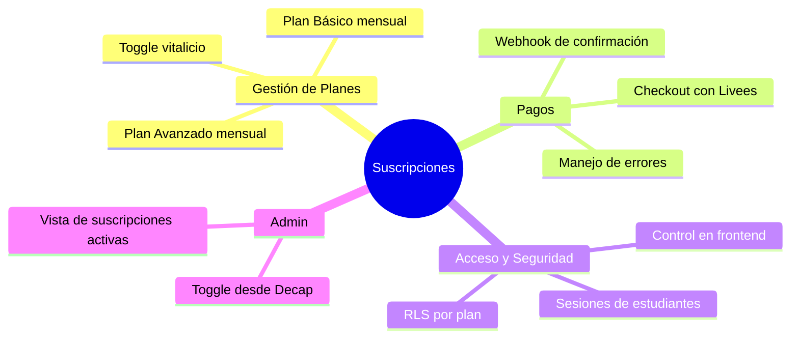

# Documento Interno — Historias de Usuario, Criterios y Checklist
> ⚠️ USO INTERNO — No compartir con el cliente

---

## Épicas del Proyecto

---

## Historias de Usuario

### 🔵 Épica 1 — Gestión de Planes

---

**HU-01 · Selección de plan**
> Como estudiante, quiero ver los planes disponibles con sus precios y beneficios, para poder elegir el que mejor se adapte a mis necesidades.

**Criterios de aceptación:**
- [ ] La página de planes muestra Plan Básico y Plan Avanzado siempre visibles
- [ ] El Plan Vitalicio solo aparece si el admin lo tiene habilitado
- [ ] Cada plan muestra claramente: precio, frecuencia y lista de accesos incluidos
- [ ] Existe un CTA ("Suscribirse") por cada plan

---

**HU-02 · Toggle del plan vitalicio (admin)**
> Como administrador, quiero poder activar o desactivar el plan vitalicio desde el panel, para controlar cuándo está disponible sin afectar a usuarios que ya lo compraron.

**Criterios de aceptación:**
- [ ] Existe un toggle en el panel de Decap CMS para habilitar/deshabilitar el plan vitalicio
- [ ] Al desactivar, el plan deja de aparecer en la página pública de planes
- [ ] Al desactivar, los usuarios que ya tienen el plan vitalicio mantienen su acceso sin cambios
- [ ] Al reactivar, el plan vuelve a aparecer inmediatamente en la UI

---

### 🟣 Épica 2 — Pagos con Livees Checkout

---

**HU-03 · Proceso de pago exitoso**
> Como estudiante, quiero pagar mi suscripción de forma segura a través de Livees Checkout, para activar mi acceso inmediatamente después de confirmar el pago.

**Criterios de aceptación:**
- [ ] Al hacer clic en "Suscribirse", el usuario es redirigido al checkout de Livees con el plan correcto
- [ ] Livees recibe el `planId` y `userId` correctamente
- [ ] Tras un pago exitoso, Livees envía el webhook a la Netlify Function correspondiente
- [ ] La Edge Function de Supabase actualiza el registro del usuario: `status = active`, `plan`, `renews_at`
- [ ] El usuario es redirigido de vuelta a la app con su acceso ya activo
- [ ] El usuario ve un mensaje de confirmación de suscripción

---

**HU-04 · Manejo de pago fallido**
> Como estudiante, quiero recibir un mensaje claro si mi pago falla, para poder corregir mis datos y reintentar sin perder lo que seleccioné.

**Criterios de aceptación:**
- [ ] Si el pago falla, el webhook lo registra en la DB como intento fallido
- [ ] El usuario ve un mensaje de error claro con opción de reintentar
- [ ] El estado del usuario no cambia a "activo" si el pago no fue exitoso
- [ ] El usuario puede volver a intentar con otro método de pago

---

**HU-05 · Renovación mensual automática**
> Como estudiante con plan mensual, quiero que mi suscripción se renueve automáticamente cada mes, para no perder el acceso sin que tenga que hacer nada.

**Criterios de aceptación:**
- [ ] Livees envía webhook de renovación exitosa cada ciclo mensual
- [ ] La Edge Function actualiza `renews_at` al nuevo período
- [ ] Si la renovación falla, el estado del usuario pasa a `past_due`
- [ ] _(Email de aviso: pendiente definir servicio)_

---

### 🟢 Épica 3 — Control de Acceso

---

**HU-06 · Acceso según plan activo**
> Como estudiante, quiero que la aplicación me muestre solo el contenido al que tengo derecho según mi plan, para tener una experiencia clara y consistente.

**Criterios de aceptación:**
- [ ] Usuario sin plan: solo ve contenido público (landing, planes, login)
- [ ] Usuario con Plan Básico: accede a recursos básicos, recursos avanzados aparecen bloqueados o no visibles
- [ ] Usuario con Plan Avanzado: accede a todos los recursos básicos y avanzados
- [ ] Usuario con Plan Vitalicio: accede a todo el contenido sin restricciones
- [ ] Las políticas RLS en Supabase son la fuente de verdad — el frontend no es el guardián

---

**HU-07 · Suscripción cancelada o vencida**
> Como estudiante cuya suscripción venció o fue cancelada, quiero recibir un aviso claro y la opción de renovar, para poder recuperar mi acceso fácilmente.

**Criterios de aceptación:**
- [ ] Si `status = cancelled` o `status = past_due`, el usuario ve solo el contenido público
- [ ] La app muestra un banner o página informando que la suscripción no está activa
- [ ] El usuario tiene un CTA directo para reactivar o elegir un nuevo plan

---

### 🟠 Épica 4 — Panel de Administración

---

**HU-08 · Vista de suscripciones activas (admin)**
> Como administrador, quiero ver qué usuarios tienen suscripciones activas y qué plan tienen, para tener visibilidad del estado del negocio.

**Criterios de aceptación:**
- [ ] Desde Decap CMS o panel admin, se puede consultar la tabla de suscripciones
- [ ] Se muestra: usuario, plan, estado, fecha de renovación
- [ ] La consulta usa la API Key de servicio (no la ANON key pública)

---

## ✅ Checklist General de Tareas

### Base de Datos (Supabase)
- [x] Crear tabla `plans` — usada `products` como catálogo (ver changelog)
- [x] Crear tabla `subscriptions` — ya existía con esquema compatible
- [x] Crear política RLS: lectura de recursos según plan activo — helpers `has_active_plan()` y `get_active_billing_interval()` creados; policy en tablas de contenido pendiente hasta definir esas tablas
- [x] Crear política RLS: el usuario solo puede leer su propia suscripción — ya existía, verificada
- [x] Insertar los 3 planes en `products` (Básico, Avanzado, Vitalicio — vitalicio oculto por defecto)
- [x] Probar RLS con usuario de prueba por cada plan — Tests 1–7 ejecutados y confirmados

### Livees Checkout
- [ ] Crear productos en Livees: Plan Básico (mensual), Plan Avanzado (mensual), Plan Vitalicio (único)
- [ ] Configurar URL de retorno (success y cancel) apuntando a la app
- [ ] Configurar URL del webhook apuntando a la Netlify Function
- [ ] Documentar el `webhook_secret` en las variables de entorno

### Netlify Functions
- [ ] Crear función `/handle-payment` que reciba el webhook de Livees
- [ ] Validar la firma del webhook con el `webhook_secret`
- [ ] Llamar a la Supabase Edge Function con los datos del evento
- [ ] Retornar `200 OK` a Livees en todos los casos (incluido error, para evitar reintentos no deseados)

### Supabase Edge Functions
- [ ] Crear función `update-subscription` que actualice la DB según el evento recibido
- [ ] Manejar eventos: `payment.success`, `payment.failed`, `subscription.renewed`, `subscription.cancelled`
- [ ] Probar cada evento con datos de prueba

### Frontend (React + Vite)
- [ ] Crear página `/planes` con tarjetas por plan
- [ ] Lógica de visibilidad del Plan Vitalicio según flag en DB o CMS
- [ ] Botón "Suscribirse" que redirige al checkout de Livees con `planId` y `userId`
- [ ] Página de retorno post-pago: éxito y error
- [ ] Hook o contexto para leer el plan activo del usuario desde Supabase
- [ ] Guard de rutas: redirigir si el usuario no tiene el plan requerido
- [ ] Banner de suscripción inactiva con CTA de reactivación

### Admin (Decap CMS / Netlify)
- [ ] Agregar campo toggle en Decap para habilitar/deshabilitar Plan Vitalicio
- [ ] Conectar ese valor a la visibilidad del plan en el frontend

### QA y Deploy
- [ ] Prueba: flujo completo Básico (registro → pago → acceso)
- [ ] Prueba: flujo completo Avanzado (registro → pago → acceso diferenciado)
- [ ] Prueba: pago fallido y reintento
- [ ] Prueba: toggle vitalicio (activar/desactivar desde admin)
- [ ] Prueba: acceso con suscripción vencida
- [ ] Configurar variables de entorno en Netlify (producción)
- [ ] Deploy final y smoke test en producción

---

*Documento interno — actualizar el checklist conforme avanza el desarrollo*
