# Plan de Acción — Admin: gestión de estudiantes y suscripciones

> Generado: 2026-07-29 · Ampliado: 2026-08-01
> Roadmap fuente: [ROADMAP-admin-suscripciones.md](./ROADMAP-admin-suscripciones.md)
> Corte de alcance: Fases 0–3 inmediatas (confirmado 2026-07-29, ya en producción).
> Fases 4–5 pasadas a inmediato el 2026-08-01 (usuario pidió "fase 4 en adelante").

---

## Fase 0 — Instalar framework de testing [inmediato]

### 0.1 Instalar Vitest
- AC1 [Importante]: correr `pnpm add -D vitest` → `package.json` tiene `vitest` en `devDependencies`.
- AC2 [Importante]: agregar script `"test": "vitest run"` en `package.json` → `pnpm test` corre y reporta "no test files found" sin error de configuración.

---

## Fase 1 — Rol admin y ruta protegida [inmediato]

### 1.1 Guard `AdminRoute`
- AC1 [Crítico]: crear `src/components/auth/AdminRoute.tsx` que redirige a `/` si `profile.role !== 'admin'` → navegar a la ruta protegida sin sesión admin muestra redirect, con sesión `role='admin'` muestra children.
  - Historia de usuario: Como admin del negocio, quiero que solo yo pueda entrar al panel de estudiantes, para que ningún usuario final vea datos de otros.

### 1.2 Ruta `/panel/estudiantes` en el router
- AC1 [Importante]: agregar entrada en `src/app/Routes.tsx` envuelta en `AdminRoute` → visitar `/panel/estudiantes` logueado como admin renderiza la página (aunque esté vacía todavía).
- Nota: NO usar `/admin/*` — reservado a nivel Netlify (`netlify.toml` + `public/_redirects`) para Decap CMS, se sirve estático antes de que React Router intervenga.

### 1.3 Asignar rol admin al usuario dueño del negocio
- AC1 [Crítico]: `UPDATE profiles SET role = 'admin' WHERE id = '<uuid del dueño>'` ejecutado en Supabase → `SELECT role FROM profiles WHERE id = '<uuid>'` devuelve `admin`.
  - Historia de usuario: Como dueño del negocio, quiero que mi cuenta tenga rol admin, para poder entrar al panel apenas esté listo.

---

## Fase 2 — Modelo de datos de suscripciones [inmediato]

### 2.1 Crear carpeta de migraciones versionadas
- AC1 [Importante]: crear `supabase/migrations/` con primer archivo `0001_init_baseline.sql` documentando el schema actual (`profiles`, `payments`, `payment_events`) → `supabase db diff` local no muestra drift contra el schema remoto real.

### 2.2 Migración: tabla `subscriptions`
- AC1 [Crítico]: nueva migración `000X_create_subscriptions.sql` con columnas `id, user_id (fk profiles), plan, status ('active'|'inactive'|'expired'), start_date, end_date, created_at, updated_at` → `supabase migration up` aplica sin error y `\d subscriptions` en psql muestra las columnas.
  - Historia de usuario: Como admin, quiero que el sistema calcule automáticamente si la suscripción de un estudiante está activa, por vencer o vencida, para saber a quién contactar sin calcular fechas a mano.
- AC2 [Crítico] (unit test primordial): función pura `computeSubscriptionStatus(sub, now)` que devuelve `'active' | 'expiring_soon' | 'expired'` según `end_date` vs `now` → test cubre: fecha futura lejana = `active`, fecha dentro de 7 días = `expiring_soon`, fecha pasada = `expired`.

### 2.3 Migración: columna `phone` en `profiles`
- AC1 [Importante]: migración agrega `ALTER TABLE profiles ADD COLUMN phone text` → columna visible en `\d profiles`.

### 2.4 Capturar `phone` en el signup
- AC1 [Importante]: agregar campo teléfono al formulario en `src/components/organisms/signup/index.tsx`, guardado en `profiles.phone` vía `ensure-profile` o update posterior → crear cuenta nueva con teléfono, `SELECT phone FROM profiles WHERE id=<uuid>` devuelve el valor cargado.

---

## Fase 3 — Listado de estudiantes (lectura) [inmediato]

### 3.1 Edge function `admin-list-students`
- AC1 [Crítico]: nueva función en `supabase/functions/admin-list-students/index.ts`, rechaza si `profiles.role` del caller ≠ `admin` (401) → invocar con JWT de usuario no-admin devuelve 401; con JWT admin devuelve 200 + array de `{id, full_name, phone, subscription}`.
  - Historia de usuario: Como admin, quiero ver la lista de estudiantes con su estado de suscripción, para saber a quién gestionar.

### 3.2 UI: tabla de estudiantes en `/panel/estudiantes`
- AC1 [Importante]: página consume `admin-list-students` y renderiza tabla con nombre, teléfono, estado de suscripción → cargar la página muestra tantas filas como estudiantes existan en `profiles`.

---

## Fase 4 — Activar/desactivar y cambiar de suscripción [inmediato]

> Corregida contra el schema real (ver nota en el roadmap fuente): sin `status='inactive'`
> ni `plan` texto libre — usa `subscriptions.status` (enum real) y `product_id → products`.

### 4.1 Edge function `admin-update-subscription`
- AC1 [Crítico]: recibe `{ user_id, action: 'activate'|'deactivate'|'change_plan', product_code? }`, valida caller admin (mismo patrón que `admin-list-students`) → `action:'deactivate'` deja `status='canceled'` y `canceled_at=now()`; `action:'activate'` deja `status='active'`, `current_period_start=now()`, `current_period_end` recalculado según `billing_interval` del producto actual; `action:'change_plan'` busca `products.id` por `product_code` y actualiza `subscriptions.product_id`, recalculando `current_period_end`.
  - Historia de usuario: Como admin, quiero activar, desactivar o cambiar el plan de un estudiante directamente desde el panel, para no depender de SQL manual cuando alguien paga o deja de pagar.
- AC2 [Crítico] (unit test primordial): función pura `nextPeriodEnd(product, from)` → test cubre `billing_interval='monthly'` = `from + 1 mes`, `billing_interval='one_time'` = `null` (vitalicio no vence).
- AC3 [Importante]: `action:'change_plan'` con un `product_code` inexistente devuelve 400, no crashea ni deja `product_id` en `null` → invocar con `product_code:'no-existe'` responde 400 y la fila de `subscriptions` queda sin cambios.

### 4.2 UI: botones activar/desactivar/cambiar plan por fila
- AC1 [Importante]: cada fila de la tabla en `/panel/estudiantes` tiene botones que llaman a `admin-update-subscription` y refrescan el estado mostrado sin recargar la página → click en "Desactivar" cambia el badge de esa fila a "Cancelado" al toque.
- AC2 [Importante]: "Cambiar plan" ofrece un selector con los `code` reales de `products` (`plan-basico`, `plan-avanzado`, `plan-vitalicio`), no texto libre → el selector solo permite elegir de esas 3 opciones.
- AC3 [Deseable]: botones muestran estado de carga mientras la request está en vuelo → doble click no dispara dos requests simultáneas a `admin-update-subscription`.

---

## Fase 5 — WhatsApp (wa.me) y recordatorio de vencimiento [inmediato]

### 5.1 Botón "Enviar mensaje" por WhatsApp
- AC1 [Importante]: botón por fila abre `https://wa.me/<phone>?text=<mensaje precargado>` en nueva pestaña, deshabilitado si `phone` está vacío → fila sin teléfono muestra botón deshabilitado; fila con teléfono abre WhatsApp Web con el número correcto.

### 5.2 Botón "Recordar vencimiento"
- AC1 [Importante]: visible solo si el `computedStatus` de esa fila (ya calculado por `admin-list-students`) es `expiring_soon` o `expired` → fila con `current_period_end` a 3 días muestra el botón; fila con `current_period_end` a 60 días o `plan-vitalicio` (`current_period_end=null`) no lo muestra.
  - Historia de usuario: Como admin, quiero ver de un vistazo a qué estudiantes tengo que recordarles que van a vencer, para no revisar fecha por fecha a mano.
- AC2 [Importante]: click abre `wa.me` con mensaje precargado que incluye la fecha real de vencimiento de esa fila → el mensaje contiene `current_period_end` formateado en `dd/mm/yyyy`.

---

## Estado de ejecución

**2026-07-30 / 2026-07-31** — Fases 0–3 completas y en producción: migraciones aplicadas,
`admin-list-students` y `ensure-profile` deployadas, rol admin asignado, ruta corregida a
`/panel/estudiantes` (`/admin/*` está reservado a nivel Netlify para Decap CMS), esquema de
`admin-list-students` corregido contra el schema real (`products`/`subscriptions` ya
existentes desde 2026-05-30). Detalle completo en
[PASOS-PENDIENTES-admin-suscripciones.md](./PASOS-PENDIENTES-admin-suscripciones.md).

**2026-08-01** — Fase 4 y Fase 5 pasadas de "mediano plazo" a "inmediato", corregidas contra
el schema real, y ejecutadas: `nextPeriodEnd` (+2 tests), edge function
`admin-update-subscription` (activate/deactivate/change_plan) deployada, botones de
activar/desactivar/cambiar plan + WhatsApp (mensaje libre y recordatorio de vencimiento) en
`/panel/estudiantes`. Verificado con `pnpm test` (6/6), `pnpm exec tsc --noEmit`, `pnpm run build`.
Falta deploy del frontend (push a producción) — el código ya está en el repo local.

---

## WBS — ASCII

```
Admin: Gestión de estudiantes y suscripciones
├── Fase 0 — Testing framework [inmediato]
│   └── 0.1 Instalar Vitest
├── Fase 1 — Rol admin y ruta protegida [inmediato]
│   ├── 1.1 AdminRoute guard
│   ├── 1.2 Ruta /panel/estudiantes
│   └── 1.3 Asignar rol admin (manual, una vez)
├── Fase 2 — Modelo de datos de suscripciones [inmediato]
│   ├── 2.1 Carpeta de migraciones versionadas
│   ├── 2.2 Tabla subscriptions + computeSubscriptionStatus (test)
│   ├── 2.3 Columna phone en profiles
│   └── 2.4 Capturar phone en signup
├── Fase 3 — Listado de estudiantes (lectura) [inmediato]
│   ├── 3.1 Edge function admin-list-students
│   └── 3.2 UI tabla de estudiantes
├── Fase 4 — Activar/desactivar/cambiar plan [inmediato]
│   ├── 4.1 Edge function admin-update-subscription + nextPeriodEnd (test)
│   └── 4.2 UI botones activar/desactivar/cambiar plan por fila
└── Fase 5 — WhatsApp [inmediato]
    ├── 5.1 Botón enviar mensaje (wa.me)
    └── 5.2 Botón recordar vencimiento
```

## WBS — Mermaid

```mermaid
flowchart TD
  A[Admin: Estudiantes y Suscripciones] --> F0["Fase 0: Testing framework (inmediato)"]
  F0 --> F0_1[0.1 Instalar Vitest]

  A --> F1["Fase 1: Rol admin y ruta protegida (inmediato)"]
  F1 --> F1_1[1.1 AdminRoute guard]
  F1 --> F1_2[1.2 Ruta /panel/estudiantes]
  F1 --> F1_3[1.3 Asignar rol admin]

  A --> F2["Fase 2: Modelo de datos (inmediato)"]
  F2 --> F2_1[2.1 Carpeta migrations]
  F2 --> F2_2["2.2 Tabla subscriptions (+ test)"]
  F2 --> F2_3[2.3 Columna phone]
  F2 --> F2_4[2.4 Capturar phone en signup]

  A --> F3["Fase 3: Listado de estudiantes (inmediato)"]
  F3 --> F3_1[3.1 Edge function admin-list-students]
  F3 --> F3_2[3.2 UI tabla de estudiantes]

  A --> F4["Fase 4: Activar-desactivar-cambiar plan (inmediato)"]
  F4 --> F4_1["4.1 Edge function admin-update-subscription (+ nextPeriodEnd test)"]
  F4 --> F4_2[4.2 UI botones por fila]

  A --> F5["Fase 5: WhatsApp (inmediato)"]
  F5 --> F5_1[5.1 Botón enviar mensaje]
  F5 --> F5_2[5.2 Botón recordar vencimiento]
```


