# Roadmap — Admin: gestión de estudiantes y suscripciones

> Generado: 2026-07-29
> Fuente de intención: [docs/features/feat-admin-activar-suscripcion.md](../features/feat-admin-activar-suscripcion.md)
> Complementa: no existe roadmap previo en el repo (primera versión).

## Contradicción detectada y resuelta con el usuario

El doc de feature pide "activar/desactivar suscripción" + "recordatorio de vencimiento",
pero el código verificado (`supabase/functions/get-access/index.ts`, `SubscriptionPage.tsx`)
implementa **acceso permanente por pago único** (`payments` + `ACCESS_PRODUCT_ID`, sin fecha
de expiración). Decisión del usuario: migrar a un modelo de **suscripciones recurrentes reales**
(plan + fecha de vencimiento), no solo un flag on/off. Esto agranda el alcance más allá del
panel admin — toca checkout, `get-access` y la página de pricing.

## Brechas verificadas contra el código (no asumidas desde el doc)

- No existe tabla `subscriptions` ni columna de expiración en `profiles` ni `payments`.
- No existe `supabase/migrations/` en el repo — el schema no está versionado en git todavía.
- No existe rol `admin` chequeado en ningún lugar del código (`ProtectedRoute` solo valida `user` logueado).
- No existe ninguna ruta `/admin` en `src/app/Routes.tsx` para gestión de usuarios (el único "admin" hoy es Decap CMS, que edita JSON en el repo, no filas de Supabase).
- `profiles` no tiene columna `phone` — requisito para el botón de WhatsApp.
- No hay integración de WhatsApp en el código (confirmado: cero referencias a `wa.me` o SDK de WhatsApp).
- No hay framework de testing instalado (`package.json` sin `vitest`/`jest`/`testing-library`).

## Fases (orden de dependencia)

### Fase 0 — Instalar framework de testing
Bloquea Fase 3 (lógica de cálculo de estado de suscripción es lógica de negocio pura, necesita test).

### Fase 1 — Rol admin y ruta protegida
Bloquea todo lo demás: sin gating, no hay panel seguro donde construir el resto.

### Fase 2 — Modelo de datos de suscripciones (migración SQL)
Bloquea Fase 3, 4 y 5 — todas leen/escriben esta tabla.

### Fase 3 — Listado de estudiantes en el admin (lectura)
Depende de Fase 1 (ruta protegida) y Fase 2 (tabla existe). Bloquea Fase 4 (activar/desactivar necesita la fila ya visible en UI).

### Fase 4 — Activar/desactivar y cambiar de suscripción (escritura)
Depende de Fase 3.

### Fase 5 — Mensajes WhatsApp (wa.me) y recordatorio de vencimiento
El botón de mensaje libre depende solo de Fase 3 (tener `phone` visible). El botón de
recordatorio de vencimiento depende de Fase 2 (campo `end_date`). Pueden ir en paralelo
entre sí, ambos después de Fase 3.

---

## Fase 0 — Instalar framework de testing

### 0.1 Instalar Vitest
- AC1: correr `pnpm add -D vitest` → `package.json` tiene `vitest` en `devDependencies`.
- AC2: agregar script `"test": "vitest run"` en `package.json` → `pnpm test` corre y reporta "no test files found" sin error de configuración.

---

## Fase 1 — Rol admin y ruta protegida

### 1.1 Guard `AdminRoute`
- AC1: crear `src/components/auth/AdminRoute.tsx` que redirige a `/` si `profile.role !== 'admin'` → navegar a la ruta protegida sin sesión admin muestra redirect, con sesión `role='admin'` muestra children.
- Historia de usuario (crítico): Como admin del negocio, quiero que solo yo pueda entrar al panel de estudiantes, para que ningún usuario final vea datos de otros.

### 1.2 Ruta `/panel/estudiantes` en el router
- AC1: agregar entrada en `src/app/Routes.tsx` envuelta en `AdminRoute` → visitar `/panel/estudiantes` logueado como admin renderiza la página (aunque esté vacía todavía).
- Nota: NO usar `/admin/*` — ese prefijo ya está reservado a nivel Netlify (`netlify.toml` y `public/_redirects`) para servir Decap CMS de forma estática, antes de que React Router vea la request. Cualquier ruta bajo `/admin/*` sería interceptada y nunca llegaría a la SPA.

### 1.3 Asignar rol admin al usuario dueño del negocio
- AC1: `UPDATE profiles SET role = 'admin' WHERE id = '<uuid del dueño>'` ejecutado en Supabase → `SELECT role FROM profiles WHERE id = '<uuid>'` devuelve `admin`.

---

## Fase 2 — Modelo de datos de suscripciones

### 2.1 Crear carpeta de migraciones versionadas
- AC1: crear `supabase/migrations/` con primer archivo `0001_init_baseline.sql` documentando el schema actual (`profiles`, `payments`, `payment_events`) → `supabase db diff` local no muestra drift contra el schema remoto real.

### 2.2 Migración: tabla `subscriptions`
- AC1: nueva migración `000X_create_subscriptions.sql` con columnas `id, user_id (fk profiles), plan, status ('active'|'inactive'|'expired'), start_date, end_date, created_at, updated_at` → `supabase migration up` aplica sin error y `\d subscriptions` en psql muestra las columnas.
- AC2 (unit test primordial): función pura `computeSubscriptionStatus(sub, now)` que devuelve `'active' | 'expiring_soon' | 'expired'` según `end_date` vs `now` → test cubre: fecha futura lejana = `active`, fecha dentro de 7 días = `expiring_soon`, fecha pasada = `expired`.

### 2.3 Migración: columna `phone` en `profiles`
- AC1: migración agrega `ALTER TABLE profiles ADD COLUMN phone text` → columna visible en `\d profiles`.

### 2.4 Capturar `phone` en el signup
- AC1: agregar campo teléfono al formulario en `src/components/organisms/signup/index.tsx`, guardado en `profiles.phone` vía `ensure-profile` o update posterior → crear cuenta nueva con teléfono, `SELECT phone FROM profiles WHERE id=<uuid>` devuelve el valor cargado.

---

## Fase 3 — Listado de estudiantes (lectura)

### 3.1 Edge function `admin-list-students`
- AC1: nueva función en `supabase/functions/admin-list-students/index.ts`, rechaza si `profiles.role` del caller ≠ `admin` (401) → invocar con JWT de usuario no-admin devuelve 401; con JWT admin devuelve 200 + array de `{id, full_name, phone, subscription}`.

### 3.2 UI: tabla de estudiantes en `/panel/estudiantes`
- AC1: página consume `admin-list-students` y renderiza tabla con nombre, teléfono, estado de suscripción → cargar la página muestra tantas filas como estudiantes existan en `profiles`.

---

## Fase 4 — Activar/desactivar y cambiar de suscripción (escritura)

> ⚠️ Corregido 2026-08-01 contra el schema real (ver "Corrección 2026-07-31" arriba y
> `claude/db/01_verify_existing_schema.sql`). Versión original asumía `status='inactive'`
> (no existe en el enum `subscription_status`: `active, past_due, canceled, incomplete,
> pending, cancelled`) y un `plan` texto libre mensual/anual (el modelo real es
> `subscriptions.product_id → products`, con `products.billing_interval` en `monthly` |
> `one_time`, catálogo ya sembrado: `plan-basico`, `plan-avanzado`, `plan-vitalicio`).

### 4.1 Edge function `admin-update-subscription`
- AC1: recibe `{ user_id, action: 'activate'|'deactivate'|'change_plan', product_code? }`, valida caller admin, hace `upsert` en `subscriptions` → `action:'deactivate'` deja `status='canceled'` y `canceled_at=now()`; `action:'activate'` deja `status='active'`, `current_period_start=now()` y `current_period_end` recalculado según `products.billing_interval` del producto actual; `action:'change_plan'` con `product_code` busca el `id` en `products` por `code` y actualiza `subscriptions.product_id`, recalculando `current_period_end` igual que activate.
- AC2 (unit test primordial): función pura `nextPeriodEnd(product, from)` que calcula la próxima fecha de vencimiento según `billing_interval` → test cubre `billing_interval='monthly'` = `from + 1 mes`, `billing_interval='one_time'` = `null` (vitalicio no vence).

### 4.2 UI: botones activar/desactivar/cambiar plan por fila
- AC1: en la tabla de 3.2, cada fila tiene botones que llaman a `admin-update-subscription` y refrescan el estado mostrado → click en "Desactivar" cambia el badge de esa fila a "Cancelado" (no "Inactivo") sin recargar la página.
- AC2: "Cambiar plan" ofrece únicamente los `code` reales de `products` (`plan-basico`, `plan-avanzado`, `plan-vitalicio`) → el selector no permite texto libre.

---

## Fase 5 — WhatsApp (wa.me) y recordatorio de vencimiento

### 5.1 Botón "Enviar mensaje" por WhatsApp
- AC1: botón por fila abre `https://wa.me/<phone>?text=<mensaje precargado>` en nueva pestaña, deshabilitado si `phone` está vacío → fila sin teléfono muestra botón deshabilitado; fila con teléfono abre WhatsApp Web con el número correcto.

### 5.2 Botón "Recordar vencimiento"
- AC1: visible solo si `computedStatus` (de `admin-list-students`, basado en `computeSubscriptionStatus` + `current_period_end`) es `expiring_soon` o `expired` → fila con `current_period_end` a 3 días muestra el botón; fila con `current_period_end` a 60 días no lo muestra; fila `plan-vitalicio` (`current_period_end=null`) nunca lo muestra.
- AC2: click abre `wa.me` con mensaje precargado que incluye la fecha de vencimiento real de esa fila → mensaje contiene la fecha exacta de `current_period_end` formateada.

---

## WBS — ASCII

```
Admin: Gestión de estudiantes y suscripciones
├── Fase 0 — Testing framework
│   └── 0.1 Instalar Vitest
├── Fase 1 — Rol admin y ruta protegida
│   ├── 1.1 AdminRoute guard
│   ├── 1.2 Ruta /panel/estudiantes
│   └── 1.3 Asignar rol admin (manual, una vez)
├── Fase 2 — Modelo de datos de suscripciones
│   ├── 2.1 Carpeta de migraciones versionadas
│   ├── 2.2 Tabla subscriptions + computeSubscriptionStatus (test)
│   ├── 2.3 Columna phone en profiles
│   └── 2.4 Capturar phone en signup
├── Fase 3 — Listado de estudiantes (lectura)
│   ├── 3.1 Edge function admin-list-students
│   └── 3.2 UI tabla de estudiantes
├── Fase 4 — Activar/desactivar/cambiar plan (escritura)
│   ├── 4.1 Edge function admin-update-subscription + nextPeriodEnd (test)
│   └── 4.2 UI botones por fila
└── Fase 5 — WhatsApp
    ├── 5.1 Botón enviar mensaje (wa.me)
    └── 5.2 Botón recordatorio de vencimiento
```

## WBS — Mermaid

```mermaid
flowchart TD
  A[Admin: Estudiantes y Suscripciones] --> F0[Fase 0: Testing framework]
  F0 --> F0_1[0.1 Instalar Vitest]

  A --> F1[Fase 1: Rol admin y ruta protegida]
  F1 --> F1_1[1.1 AdminRoute guard]
  F1 --> F1_2[1.2 Ruta /panel/estudiantes]
  F1 --> F1_3[1.3 Asignar rol admin]

  A --> F2[Fase 2: Modelo de datos]
  F2 --> F2_1[2.1 Carpeta migrations]
  F2 --> F2_2["2.2 Tabla subscriptions (+ test)"]
  F2 --> F2_3[2.3 Columna phone]
  F2 --> F2_4[2.4 Capturar phone en signup]

  A --> F3[Fase 3: Listado de estudiantes]
  F3 --> F3_1[3.1 Edge function admin-list-students]
  F3 --> F3_2[3.2 UI tabla de estudiantes]

  A --> F4[Fase 4: Activar-desactivar-cambiar plan]
  F4 --> F4_1["4.1 Edge function admin-update-subscription (+ nextPeriodEnd test)"]
  F4 --> F4_2[4.2 UI botones por fila]

  A --> F5[Fase 5: WhatsApp]
  F5 --> F5_1[5.1 Botón enviar mensaje]
  F5 --> F5_2[5.2 Botón recordatorio de vencimiento]
```


